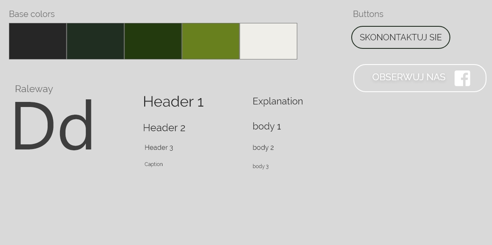
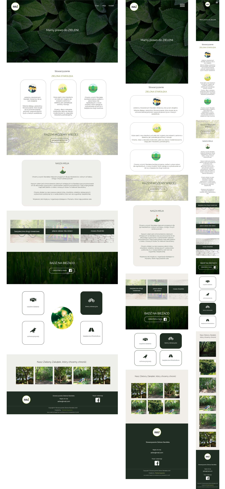

## Website for non-govermental organization

Website was made for local NGO in city of Poznań, that supports preservation of green areas and watching over the reasonable infrastructure development in particular districts.

I designed layout views (desktop, table, mobile) with Adobe Xd.

Site was build with CSS Grid Layout, with fallback for older browsers with no grid support (feature queries).

#### Page content
* Website is One Page due to informative character character of its content.
* Layout contains of major information about the organization goals and undertaken activities.
* Page is presented in responsive manner (media queries).

#### For users:

You can visit website on https://zielona-staroleka.pl

#### For developers [Setup instructions]
* Copy or clone this repository
* You need NPM and GULP installed
* Cd to project directory and run `gulp`
* Website will be served on: `http://localhost:3000/`

#### Dependencies
* Website layout [CSS Grid Layout](https://css-tricks.com/snippets/css/complete-guide-grid/)
* Icons by [Fontawesome](https://fontawesome.com/) and [Flaticon](https://www.flaticon.com/)
* Images by [Pexels](https://www.pexels.com/)
* Automatation by [Gulp](https://gulpjs.com/)
* Colors inspiration https://coolors.co/
* Page design made in [Adobe Xd](https://www.adobe.com/products/xd.html)
